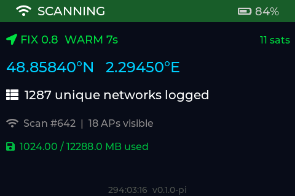

# WarDrivingMapper — Raspberry Pi

A Raspberry Pi wardriving device that **mirrors the ESP32 firmware's UI**, built
by reusing the firmware's LVGL screen code on Linux.

Part of the WarDrivingMapper family (firmware · backend · iOS · **pi**). Talks to
the same backend HTTP API; no shared code with the other repos.

## Status

Early bring-up. The ESP32 **SCAN dashboard renders pixel-faithfully** on a
headless Linux build — LVGL 8.4 plus the firmware's `display.c` screen code,
unmodified.



## How it works

The ESP32 firmware UI is already LVGL, and LVGL has a Linux port — so the screen
code (`create_ui` / `ui_refresh` / the upload + pair screens) ports across
**verbatim**. Only the panel/touch hardware glue is replaced:

| Layer | ESP32 firmware | Pi |
|---|---|---|
| Screens | `main/display.c` | `src/ui/screens.c` (copied, glue stripped) |
| Platform | ESP-IDF + FreeRTOS | `src/platform/wdm_platform.h` shim |
| Display out | `esp_lcd` ST7789 SPI | headless PNG now → Elecrow fbdev next |
| Data | scanner / gps / nvs tasks | `platform_stub.c` now → gpsd / iw next |

## Build + run (host / Mac)

```bash
cmake -S . -B build
cmake --build build -j
./build/wdm_screenshot out.png    # render the dashboard to a PNG
```

## Layout

```
pi/
├── include/lv_conf.h          LVGL config (from firmware, host-tuned)
├── lib/lvgl/                  vendored LVGL 8.4.0 (MIT)
├── src/
│   ├── main.c                 headless render harness (mem-fb → PNG)
│   ├── ui/screens.c           ported dashboard (from firmware display.c)
│   ├── ui/strutil.c           UTF-8 → ASCII sanitizer (from firmware)
│   └── platform/              wdm_platform.h shim + stub state
├── third_party/stb_image_write.h
└── docs/design.md             design + decisions
```

## License

AGPL-3.0 (matches the platform). Vendored LVGL is MIT.
